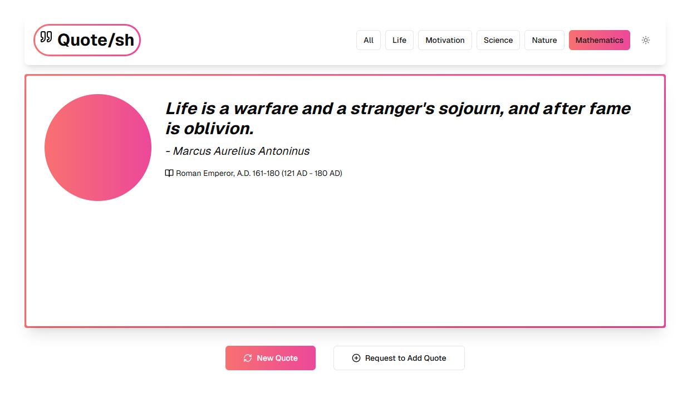

<h2 align="center">Quote/SH</h2>
<h3 align="center">A webpage to get a random quote </h3>




## Tech Stack
- Next.js
- Supabase
- Tailwind CSS
- Shadcn UI

## Features
- Random quote generator
- Dark mode support

## Live demo
You can view a fully working demo at [https://quote-sh-vj13.vercel.app/](https://quote-sh-vj13.vercel.app/).

## Version time
 - <b>V.0.1 ≈ 5hs</b>


## Clone and run locally

1. You'll first need a Supabase project which can be made [via the Supabase dashboard](https://database.new)

2. Create a Next.js app using the Supabase Starter template npx command

   ```bash
   npx create-next-app -e with-supabase
   ```

3. Use `cd` to change into the app's directory

   ```bash
   cd name-of-new-app
   ```

4. Rename `.env.local.example` to `.env.local` and update the following:

   ```
   NEXT_PUBLIC_SUPABASE_URL=[INSERT SUPABASE PROJECT URL]
   NEXT_PUBLIC_SUPABASE_ANON_KEY=[INSERT SUPABASE PROJECT API ANON KEY]
   ```

   Both `NEXT_PUBLIC_SUPABASE_URL` and `NEXT_PUBLIC_SUPABASE_ANON_KEY` can be found in [your Supabase project's API settings](https://app.supabase.com/project/_/settings/api)

5. You can now run the Next.js local development server:

   ```bash
   npm run dev
   ```

   The starter kit should now be running on [localhost:3000](http://localhost:3000/).

6. This template comes with the default shadcn/ui style initialized. If you instead want other ui.shadcn styles, delete `components.json` and [re-install shadcn/ui](https://ui.shadcn.com/docs/installation/next)

> Check out [the docs for Local Development](https://supabase.com/docs/guides/getting-started/local-development) to also run Supabase locally.